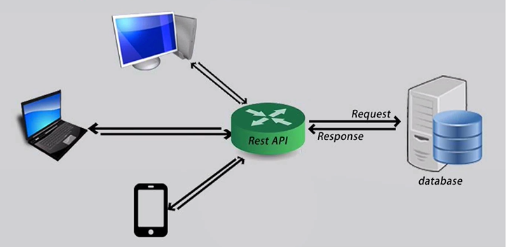
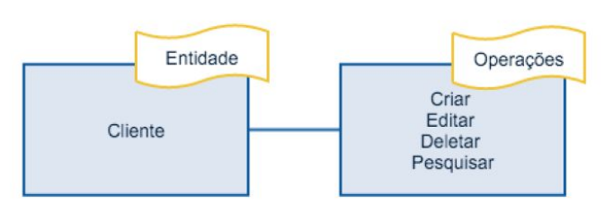
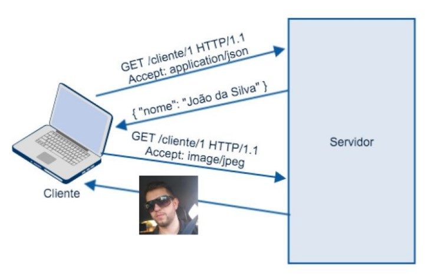

# Entendendo e documentando REST/RESTful APIs

## Links

[Curso](https://www.udemy.com/share/101AtK/)

## 2. Entendendo os conceitos que permeiam as RESTful APIs

### 2.1. O que é uma API Application

- Application Programming Interface (Interface de Programação de Aplicativos).

- API é um conjunto de rotinas e padrões de programação para acesso a um aplicativo de software.

- **Analogia:** para um DJ conseguir tocar, ele deve conhecer o que os botões dos seus aparelhos de trabalho fazem. Nas APIs, esses botões seriam as rotinas da APIs, que descrevem as ações que podem ser realizadas no serviço que aquela API cobre.

- Com o advente dos *client-side frameworks*, mais e mais desenvolvedores estão se preocupando em desenvolver o back-end que é compartilhado entre diferentes sistemas.

- A API não fica vinculada a um único tipo de sistema ou linguagem de programação.

	

### 2.2. Resource, URI, URL, URN e IRI

#### 2.2.1. Resource

- Recursos são elementos de informação, que através de um identificador global podem ser manipulados.

- Exemplo: desejo um recurso para manipular (costumeiramente: criar, selecionar, editar ou remover) os usuários da minha aplicação:
  - Recurso: Usuário;
  - ID: /user.

- A nomeação de um recurso sempre é formado por um substantivo, nunca um verbo (Isso porque o identificador de um recurso deve fazer menção a entidade que desejamos manipular e não como manipulá-las).

#### 2.2.2. URI (Uniform Resource Identifier)

- Identificador Uniforme de Recursos, ou seja, é uma cadeia de caractéres compacta usada para identificar ou denominar um recurso na internet.

- Exemplo:
  - Recurso: Usuário;
  - URI: www.meusite.com/user.

#### 2.2.3. URL (Uniform Resource Locator)

- Localizador-Padrão de Recursos, é o endereço de um recurso disponível em uma rede.

- Exemplo:
  - Recurso: Impressora;
  - URL/URI: http://www.meusite.com/printer.

#### 2.2.4. URN (Uniform Resource Name)

- Nome Uniforme de Recurso, é um tipo de URI que usa o URN Scheme e que tem por objetivo a identificação única do recurso, de forma persistente e independente da sua localização.

- Não é utilizado.

- A ideia é que um recurso tenha identificador único desvinculado de qualquer URI/URL e caso inseríssemos essa URN em um resolvedor, ele retornaria as URLs que contém aquele conteúdo.

- [Saiba mais](http://pt.wikipedia.org/wiki/URN)

#### 2.2.5. IRI (Internationalized Resource Identifier)

- Identificador de Recursos Internacionalizado é a uma generalização do URI.

- Enquanto URIs são limitados a um subconjunto de caractéres ASCII, IRIs podem conter caractéres do Conjunto Universal de Caractéres (*Universal Character Set* - Unicode/ISO 10646).

### 2.3. O que é REST?

- O termo Referência de Estado Representacional (*Representational State Transfer* - REST) foi introduzido e definido no ano de 2000 através de uma tese de Ph.D do cientista Roy Fielding, um dos principais autores da especificação do protocolo HTTP.

- O intuito geral da tese era a formalização de um conjunto de melhores práticas denominadas *constraints*.

- Essas *constraints* tinham como objetivo determinar a forma na qual padrões como HTTP e URI deveriam ser modelados, aproveitando de fato todos os recursos oferecidos pelos mesmos.

#### 2.3.1. Cliente-Servidor

- A principal característica dessa *constraint* é separar as responsabilidades de diferentes partes de um sistema.

- Essa divisão pode se dar de diferentes formas, iniciando por exemplo com a separação entre mecanismos de interface do usuário (*front-end*) e o *back-end* da aplicação.

- Isso nos permite a evolução e escabilidade destas responsabilidades de forma independente.

#### 2.3.2. Stateless

- Essa característica propõe que cada requisição ao servidor não deve ter ligação com requisições anteriores ou futuras, ou seja, cada requisição deve conter todas as informações necessárias para que ela seja tratada com sucesso pelo servidor.

#### 2.3.3. Cache

- Para uma melhor performance, um sistema REST deve permitir que suas respostas sejam passíveis de cache.

- Para casos onde o número de requisições é expressivo, se faz necessário para não afetar a disponibilidade do sistema.

#### 2.3.4. Interface Uniforme

- Bastante esforço deve ser feito para que o sistema possua uma interface modelada seguindo alguns padrões importantes.

- Quando se fala sobre uma interface, os elementos abaixo devem ser considerados:
  - Recursos;
  - Mensagens autodescritivas;
  - Hypermedia.

- Devemos pensar em criar uma interface que permita a manipulação desses conceitos.

- Exemplo:

	

#### 2.3.5. Sistema em Camadas

- Com o intuito de permitir a escalabilidade necessária para grandes sistemas distribuídos, um sistema REST deve ter capacidade de adicionar elementos intermediários e que sejam totalmente transparentes para seus clientes.

- Exemplo: Balanceador de Carga.

#### 2.3.6. Código sob demanda

- A ideia é aumentar a flexibilidade dos clientes, como por exemplo um código JavaScript que só é baixado quando determinada página é carregada.

- Apesar de ser algo interessante, essa prática reduz a visibilidade do cliente, por isso é opcional.

### 2.4. REST vs RESTful

- Quando estamos discutindo sobre o modelo e sobre as características que vimos anteriormente, você deve utilizar o termo **REST**, já no momento em que você estiver falando de uma implementação que usa essas mesmas características, você deve utilizar **RESTful**.

- **REST** nada mais é que um conjunto de melhores práticas denominadas *constraints*.

- Se a API segue os princípios **REST**, ela é uma API **RESTful**, caso contrário, teremos apenas uma API HTTP.

- **Representações:** quando o usuário solicita dados a API, ele pode informar o tipo de dado que ele espera.
  - Formatos mais utilizados: JSON (*JavaScript Object Notation*) e XML (*eXtensible Markup Language*).

	

### 2.5. REST vs SOAP (Simple Object Access Protocol)

| REST | SOAP |
| ---- | ---- |
| Modelo Arquitetural | Protocolo |
| Requisição HTTP simples | Usa SOAP envelopado no HTTP para fazer chamadas RPC (*Remote Procedure Call*) |
| Suporta vários tipos de formato (XML, JSON, YAML) | Suporta apenas XML |

### 2.6. cURL

- É uma ferramenta de linha de comando para obter ou enviar arquivos utilizando a sintaxe de URLs.

- Para instalá-la:

	- Linux: `sudo apt-get install curl`;
	- Windows: Baixar cygwin que emula terminais Linux;
	- Existem opções online.

- Uma requisição com o curl é composta da própria palavra, da URL a qual você quer acessar e um conjunto de flags que permitem modificá-la:

	| Flag | Descrição | Exemplo |
	| ---- | ---- | ---- |
	| `-H` | Permite adicionar ou substituir campos no header/cabeçalho HTTP. | `-H "Content-Type: application/json"` |
	| `-d` | Utilizamos essa opção quando queremos enviar dados no corpo da requisição. | `-d '{ "name" : "João" }'` |
	| `-i` ou `-include` | A resposta da requisição mostrará o cabeçalho, além do corpo com os dados solicitados. | - |
	| `-I` ou `-head` | A resposta da requisição mostrará apenas o cabeçalho, sem o corpo. | - |
	| `-X` ou `-request` | Essa opção determina o método/verbo HHTP que deve ser utilizado. Por padrão, é utilizado o `GET`. | - |
	| `-v` | Faz com que o resultado seja mais verboso, mostrando de fato como ocorreu a requisição. | - |
	| `--help` | Lista de flags com suas descrições. | - |

- Fake REST API online para testes: `https://jsonplaceholder.typicode.com/`.

### 2.7. Analisando uma resposta HTTP

- O que o cURL mostra como resposta de uma requisição HTTP pode ser dividido em 4 partes.

- Requisição pelo cURL:

	```
	curl -i 'https://jsonplaceholder.typicode.com/users/1'
	```

- Resposta:

	```
	HTTP/1.1 200 OK
	Date: Tue, 22 Nov 2022 00:10:17 GMT
	Content-Type: application/json; charset=utf-8
	Transfer-Encoding: chunked
	Connection: keep-alive
	X-Powered-By: Express
	X-Ratelimit-Limit: 1000
	X-Ratelimit-Remaining: 999
	X-Ratelimit-Reset: 1668975404
	Vary: Origin, Accept-Encoding
	Access-Control-Allow-Credentials: true
	Cache-Control: max-age=43200
	Pragma: no-cache
	Expires: -1
	X-Content-Type-Options: nosniff
	Etag: W/"1fd-+2Y3G3w049iSZtw5t1mzSnunngE"
	Via: 1.1 vegur
	CF-Cache-Status: HIT
	Age: 7127
	Server-Timing: cf-q-config;dur=6.9999998686399e-06
	Report-To: {"endpoints":[{"url":"https:\/\/a.nel.cloudflare.com\/report\/v3?s=BtZHkxfVyCg%2BLPl28bc6nOBuT2uvF%2BsR%2BK5BzzlOKxkvfBM5aQ2vvra13U9lWJ220bVy6YtzyVVHhRvWYyIkADkNIoUTW7biQ4KfTKd9DIwKc9synlo9xkWVn4VzQQLUwZv1hgnoQwr02tVPW0UF"}],"group":"cf-nel","max_age":604800}
	NEL: {"success_fraction":0,"report_to":"cf-nel","max_age":604800}
	Server: cloudflare
	CF-RAY: 76dd70f288081a30-EWR
	Content-Encoding: gzip
	alt-svc: h3=":443"; ma=86400, h3-29=":443"; ma=86400

	{
		"id": 1,
		"name": "Leanne Graham",
		"username": "Bret",
		"email": "Sincere@april.biz",
		"address": {
			"street": "Kulas Light",
			"suite": "Apt. 556",
			"city": "Gwenborough",
			"zipcode": "92998-3874",
			"geo": {
				"lat": "-37.3159",
				"lng": "81.1496"
			}
		},
		"phone": "1-770-736-8031 x56442",
		"website": "hildegard.org",
		"company": {
			"name": "Romaguera-Crona",
			"catchPhrase": "Multi-layered client-server neural-net",
			"bs": "harness real-time e-markets"
		}
	}
	```

#### 2.7.1. Start Line (Linha de Início)

- Obrigatória.

- No exemplo acima, é a primeira linha da resposta e pode ser dividida em duas partes:
  
	| Nome | Exemplo | Descrição |
	| ---- | ---- | ---- |
	| Request Line | `HTTP/1.1` | Versão do HTTP utilizada. |
	| Status Line | `200 OK` | Resposta do servidor. |

#### 2.7.2. Header Fields (Cabeçalho de Campos)

- 0 ou mais linhas.

- Representam os metadados da requisição e resposta HTTP. Eles contém informações de como a transferência dos dados deve ser manipulada.

- Alguns exemplos de *Header Fields*:

	| Campo | Descrição |
	| ----- | --------- |
	| `Content-Type` | Informa o formato da informação enviada de forma serializada |
	| `Content-Length` | Informa o tamanho do corpo da mensagem (em octetos). Esse campo é utilizado para verificar se chegou tudo. |

- *Header Fields* não oficiais começam com **"X"**, mas essa convenção caiu em desuso, pois existem diversos oficiais e deve-se tentar utilizá-los antes de criar os seus. 

#### 2.7.3. Empty Line (Linha Vazia)

- Obrigatória.

- Delimita o fim do *Header Fields* e início do *Message Body*.

#### 2.7.4. Message Body (Corpo da Mensagem/Requisição)

- Opcional.

- Contém os dados que foram enviados na requisição ou resposta, no formato especificado em `Content-Type`.

### 2.8. Métodos/Verbos HTTP

- Existem 9 métodos os quais podemos utilizar para a criação de uma API RESTful. Esse conjunto de métodos possui a semântica de operações possíveis a serem efetuadas sob determinado recurso.

- Os quatro primeiros métodos HTTP apresentados são os mais utilizados e representam as operações básicas que podem ser realizadas em registros de bancos de dados.

#### 2.8.1. GET

- É utilizado quando existe a necessidade de obter um recurso.

- Ele é considerado idempotente, ou seja, independente da quantidade de vezes que é executado sob um recurso, o resultado sempre será o mesmo, pois esse método não altera dados.

	```
	curl -i 'https://jsonplaceholder.typicode.com/posts/1'
	```

	ou

	```
	curl -i -X GET 'https://jsonplaceholder.typicode.com/posts/1'
	```

#### 2.8.2. POST

- Utilizado para a criação de um recurso a partir do uso de uma representação.

	```
	curl -i -X POST 'https://jsonplaceholder.typicode.com/posts' \
	-H 'Content-Type: application/json' \
	-d '{ "userId": 1, "title": "Título do Artigo", "body": "Descrição do artigo" }'
	```

- O operador `\` nos permite quebrar um comando em várias linhas dentro do terminal.

#### 2.8.3. PUT

- Utilizado como forma de atualizar um determinado recurso.

	```
	curl -i -X PUT 'https://jsonplaceholder.typicode.com/posts/1' \
	-H 'Content-Type: application/json' \
	-d '{ "userId": 2, "title": "Título do Artigo 2", "body": "Descrição do artigo 2" }'
	```

#### 2.8.4. DELETE

- Tem como finalidade a remoção de um determinado recurso.

	```
	curl -i -X DELETE 'https://jsonplaceholder.typicode.com/posts/1'
	```

#### 2.8.5. HEAD

- Muito parecido com o `GET`, a única diferença é que o servidor não retorna o corpo depois de receber a requisição.

	```
	curl -I 'https://jsonplaceholder.typicode.com/posts'
	```

#### 2.8.6. PATCH

- Realiza modificações parciais nos recursos, ou seja, fazer a alteração de valores específicos de um recurso, ao invés de enviar todos os dados novamente.

- Enquanto o método `PUT` só permite a "substituição" inteira do recurso, o `PATCH` permite modificações parciais.

- Ajuda a diminuir o tráfego de dados na rede.

	```
	curl -i -X PATCH 'https://jsonplaceholder.typicode.com/posts/1' \
	-H 'Content-Type: application/json' \
	-d '{ "title": "Título do Artigo" }'
	```

#### 2.8.7. OPTIONS

- É a forma que o cliente possui de perguntar ao servidor quais os requisitos para um determinado recurso.

- Por exemplo, pode ser utilizado para saber quais métodos podem ser aplicados ou qual URL permitida para se comunicar com determinado recurso.

	```
	curl -i -X OPTIONS 'https://jsonplaceholder.typicode.com/posts'
	```

- O *Header Field* `access-control-allow-methods` retorna os métodos permitidos para o recurso.

- Em muitos casos, porém, apenas a informação de quais os métodos permitidos não é o bastante. É interessante que seja retornado no corpo da requisição informações mais completas sobre os métodos do recurso e quais os atributos necessários para cada um deles.
  - Veja mais em `https://zacstewart.com/2012/04/14/http-options-method.html`.

#### 2.8.8. TRACE

- Ecoa de volta a requisição recebida para que o cliente veja se houveram mudanças e adições feitas por servidores intermediários.

- Desabilitado por questões de segurança.

#### 2.8.9. CONNECT

- Converte a requisição de conexão para um túnel TCP/IP transparente, usualmente para facilitar a comunicação criptografada com SSL (HTTPS) através de um proxy HTTP não criptografado. 

### 2.9. Safe Methods

- São métodos considerados "salvos". Eles não fazem causam nenhum efeito de qualquer um dos lados da requisição.

- Você pode até implementar algo para quando o *Safe Method* for chamado, como por exemplo, atualizar o contador de acessos a determinado recurso, mas o cliente não pode ser responsável por essa alteração enviando parâmetros.

- Esses métodos são `GET` e `HEAD`.

- **Métodos Idempotentes:** é uma propriedade matemática e da ciência da computação, que quando executada múltiplas vezes o resultado não será alterado depois da primeira vez.
  - Ou seja, o impacto de enviar dez requisições HTTP para um método idempotente será o mesmo de enviar uma única;
  - `GET`, `HEAD`, `PUT`, `DELETE`, `OPTIONS` e `TRACE`.