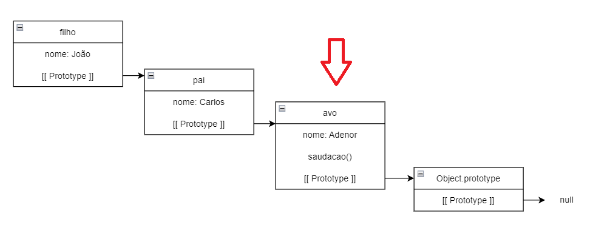

# Protótipos em JavaScript

- Diferentemente de linguagens baseadas em classes, onde os filhos herdam as propriedades dos pais (Exemplo: Java), o JavaScript realiza a herança através de protótipos.
    - Apesar de ser possível criar classes em JavaScript utilizando a palavra reservada `class`, isso nada mais é do que uma *Syntax Sugar*, pois debaixo dos panos tudo segue sendo função.

## 1. prototype

- Como já mencionado, tudo em JavaScript é função:

    ```
    typeof Array // function
    typeof Object // function
    typeof Map // function
    typeof Set // function
    ```

- Vamos criar uma função construtora `Pessoa`:

    ```
    function Pessoa (nome, idade) {
        this.nome = nome;
        this.idade = idade;
    }
    ```

- Para toda função criada, a ela é adicionada a propriedade `prototype`. Essa propriedade nos da acesso ao molde da função, utilizado na sua instanciação, através da palavra reservada `new`, criando um novo objeto.
    - No caso da função construtora `Pessoa`, caso ela seja instanciada, as propriedades armazenadas em `prototype` (`nome` e `idade`) serão adicionadas nessa nova instância.

- Essa propriedade está presente **APENAS** em **FUNÇÕES**.

- Já que `prototype` nos da acesso ao molde de funções, podemos adicionar novas funcionalidades nas mesmas durante a nossa aplicação.
    - **Não recomendado:** criei uma versão melhorada do método `Array.map` e quero que ela esteja disponível para todos os arrays da minha aplicação:

        ```
        const newMap = function (...) { ... };
        Array.prototype.newMap = newMap;
        ```
    
    - Essa nova versão do `map` pode ser acessada da mesma forma que outros métodos de `Arrays`, como `forEach`, `filter`, `reduce`, etc.

        ```
        const array = [1, 2, 3, 4, 5];
        const newArray = array.newMap(...);
        ```

- O nome `prototype` talvez não seja o nome mais adequado para essa propriedade, pois causa muita confusão com `__proto__`.

## 2. \_\_proto\_\_ ou [[ Prototype ]]

- A propriedade `__proto__` está presente tanto em funções quanto objetos e é a responsável por fazer o encadeamento das instâncias, formando a ideia de herança.

- Exemplo utilizando a função construtora `Pessoa` utilizada anteriormente:
    
    ```
    const p = new Pessoa ('João', 25);
    console.log(p.hasOwnProperty('altura'));
    ```

    - Mas espera lá... de onde veio esse método `hasOwnProperty`, já que ele não foi inserido na declaração do construtor `Pessoa`?
    - Resposta: ele foi "herdado" do protótipo do construtor `Object`.

- Como já mencionado, em JavaScript, tudo é **função**. Nesse caso, mesmo que não usual, podemos instanciar novos arrays e objetos da seguinte forma:

    ```
    const newArray = new Array(); // equivalente a: const newArray = [];
    const newObj = new Object(); // equivalente a: const newObj = {};
    ```

    - Logo, se `Object` é uma função construtora, ela possui a propriedade `prototype`, e nessa estão listados todos os métodos e atributos declarados dentro em `Object`, entre eles, `hasOwnProperty`;
    - `Object.prototype` está no topo do que chamamos de cadeia de protótipos, logo, tudo o que é inserido nela, é visível por qualquer objeto instanciado.

- Mas como dito no início, o que acontece não é bem uma herança, e sim uma delegação de responsabilidades. E esse processo ocorre utilizando a propriedade `__proto__`.

- Para fins de entendimento, podemos comparar o `__proto__` com o `next` de uma lista encadeada.

- A propriedade `__proto__` referência o objeto pai daquela instância na cadeia de protótipos.

- Na declaração de um objeto, ele possui um papel similar ao `extends`, classicamente utilizado para indicar uma situação de herança entre classes.
    - Exemplo:

        ```
        const avo = { nome: 'Adenor' };
        const pai = { __proto__: avo, nome: 'Carlos' };
        const filho = { __proto__: pai, nome: 'José' };
        ```

        - Traduzindo, `__proto__` está indicando que o objeto `pai` é filho direto do objeto `avo` e portanto, "herda" todas as suas
        propriedades. O objeto `filho`, por sua vez, "herda" as propriedades de `pai` e, portanto, de `avo`, formando a cadeia de protótipos;
        - O que acontece na verdade, é: quando utilizamos um método através do objeto `filho`, o interpretador do JavaScript verifica se o método invocado está presente em `filho` e, se sim, o executa, caso contrário, verifica se seu parente direto possui. Para saber qual seu parente e acessá-lo, ele utiliza a referência armazenada em `__proto__`;
        - O mesmo processo ocorre em `pai`e `avo`, até que o método seja encontrado. Caso nenhum deles possua o método em questão, é verificado se o pai de `avo`, `Object.prototype`, o possui, e em caso negativo, por tratar-se da raiz da cadeia de protótipos, retorna o valor `undefined`;
        - Podemos perceber com esse exemplo que o que houve não foi uma herança do objeto `filho` das propriedades de seus ancestrais, e sim uma delegação de tarefas para instâncias superiores da cadeia de protótipos.

- Esse mesmo processo acontece com nossa instância `p` de `Pessoa`, que tenta invocar o método `hasOwnProperty` sendo que nem o possui, e acabando encontrando-o em `Object.prototype`:

    

- No caso do exemplo de filho, pai e avô a cadeia fica o seguinte:

    

    - Podemos perceber que no caso anterior, o `__proto__` da instância `p` está referenciando o `prototype` da sua função construtora. Como os objetos `filho`, `pai` e `avô` foram construídos a partir da notação literal de objetos e não através de funções construtoras, é o mesmo que se tivesse sido feito `const avo = new Object();`, logo, o ancestral direto de `avo` é `Object.prototype`.

- Imaginando um cenário onde esses objetos fossem gerados a partir de funções construtoras:

    ```
    function Avo (nome) { this.nome = nome };
    function Pai (nome) { this.nome = nome };
    function Filho (nome) { this.nome = nome };

    Object.setPrototypeOf(Pai, Avo);
    Object.setPrototypeOf(Filho, Pai);

    const a = new Avo('Adenor');
    const p = new Pai('Carlos');
    const f = new Filho('José');
    ```

    - A cadeia de protótipos dessas funções ficaria da seguinte forma:

        

    - Nesse caso, pelo fato de `Avo`, `Filho` e `Pai` serem funções construtoras, elas "herdam" também as propriedades de `Function.prototype`;

    - A cadeia de protótipos das instâncias dessas funções ficaria da seguinte forma:

        

    - Pensar assim para entender: para criar um novo objeto, o Node.JS utiliza o protótipo da função construtora instanciada, logo, faz sentido que esse seja o ancestral direto da nova instância, uma vez que ela surgiu desse protótipo. 
    - Não faz sentido ela ser descendente da função construtora em si, uma vez que a instância não foi criada a partir dela e também porque objetos não conseguem executar métodos de funções, como `call` e `apply`.

- Um último exemplo:

    ```
    const array = [1, 2, 3, 4, 5];

    const arrayX10 = array.map(numero => numero * 10);

    console.log(array.hasOwnProperty('length')); // true
    ```

    - A cadeia de protótipos de array é a seguinte:

        

    - Como já explicado, inicializar um array utilizando a notação tradicional de colchetes é o mesmo que fazer `const array = new Array();`, portanto, Arrays também são gerados a partir de funções construtoras, logo, seu ancestral direto é `Array.prototype`, onde métodos como `forEach`, `map`, `filter`, `reduce`, etc. estão armazenados.