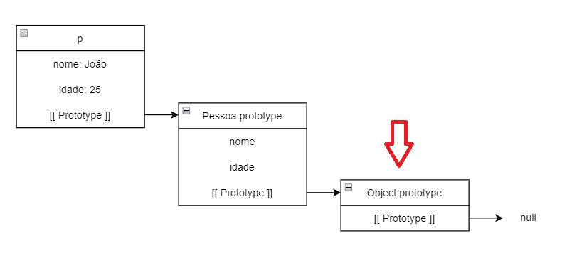

# Protótipos em JavaScript

- Diferentemente de linguagens baseadas em classes onde, os filhos herdam as propriedades dos pais através da transferência/cópia de seus atributos e métodos (Exemplo: Java), o JavaScript realiza a herança através de protótipos.
    - Apesar de ser possível criar classes em JavaScript utilizando a palavra reservada `class`, isso nada mais é do que uma *Syntax Sugar*, pois debaixo dos panos tudo segue sendo função.

## 1. prototype

- Como já mencionado, tudo em JavaScript é função:

    ```
    typeof Array // function
    typeof Object // function
    typeof Map // function
    typeof Set // function
    ```

- Vamos criar uma função construtora `Pessoa`:

    ```
    function Pessoa (nome, idade) {
        this.nome = nome;
        this.idade = idade;
    }
    ```

- Para toda função criada, a ela é adicionada a propriedade `prototype`. Essa propriedade nos da acesso ao molde da função, utilizado na sua instanciação, através da palavra reservada `new`, criando um novo objeto.
    - No caso da função construtora `Pessoa`, caso ela seja instanciada, os atributos e métodos armazenados em `prototype` (`nome` e `idade`) serão adicionados nessa nova instância.

- Essa propriedade está presente **APENAS** em **FUNÇÕES**.

- Já que `prototype` nos da acesso ao molde de funções, podemos adicionar novas funcionalidades nas mesmas durante a nossa aplicação.
    - **Não recomendado:** criei uma versão melhorada do método `Array.map` e quero que ela esteja disponível para todos os arrays da minha aplicação:

        ```
        Array.prototype.newMap = function (...) { ... };
        ```
    
    - Essa nova versão do `map` pode ser acessada da mesma forma que outros métodos de `Arrays`, como `forEach`, `filter`, `reduce`, etc.

        ```
        const array = [1, 2, 3, 4, 5];
        const newArray = array.newMap(...);
        ```

    - Esse exemplo também serve para provar que os atributos e métodos de fato não ficam depositados na função construtora e sim no seu protótipo.

## 2. constructor

- Os protótipos, por sua vez, possuem uma propriedade `constructor`, que faz referência a função construtora vinculada àquele protótipo.

- Utilizando a função construtora `Pessoa` apresentada anteriormente:

```
Pessoa.prototype.constructor === Pessoa // true
``` 

- Ou seja, podemos considerar o `constructor` como o caminho inverso do `prototype`.

## 3. \_\_proto\_\_ ou [[ Prototype ]]

- A propriedade `__proto__` está presente em objetos, protótipos e funções, e é a responsável por fazer o encadeamento das instâncias, gerando a cadeia de protótipos, forma pela qual é realizado o processo de herança em JavaScript.

- Exemplo utilizando a função construtora `Pessoa` utilizada anteriormente:
    
    ```
    const p = new Pessoa ('João', 25);
    console.log(p.hasOwnProperty('altura'));
    ```

    - Mas espera lá... de onde veio esse método `hasOwnProperty`, já que ele não foi inserido na declaração do construtor `Pessoa`?
    - Resposta: ele foi "herdado" do protótipo do construtor `Object`.

- Como já mencionado, em JavaScript, tudo é **função**. Nesse caso, mesmo que não usual, podemos instanciar novos arrays e objetos da seguinte forma:

    ```
    const newArray = new Array(); // equivalente a: const newArray = [];
    const newObj = new Object(); // equivalente a: const newObj = {};
    ```

    - Logo, se `Object` é uma função construtora, ela possui a propriedade `prototype`, e nessa estão listados todos os métodos e atributos declarados dentro em `Object`, entre eles, `hasOwnProperty`;
    - `Object.prototype` está no topo do que chamamos de cadeia de protótipos, logo, tudo o que é inserido nela, é visível por qualquer objeto instanciado.

- Mas como dito no início, o que acontece não é bem uma herança, e sim uma delegação de responsabilidades. E esse processo ocorre utilizando a propriedade `__proto__`.

- Para fins de entendimento, pense no atributo `__proto__` como o `next` de um nó em uma lista encadeada. Uma lista encadeada possui o mesmo propósito de listas tradicionais, como Arrays, com a diferença de que seus elementos não são guardados de forma sequencial na memória do computador. Nesse caso, para saber onde está localizado o próximo elemento da lista, é necessário que o nó contenha uma propriedade que armazene essa informação (costumeiramente damos o nome de `next`), possibilitando a navegação entre os
elementos dessa lista.

- A propriedade `__proto__` referência o objeto pai daquela instância na cadeia de protótipos.

- Na declaração de um objeto, ele possui um papel similar ao `extends`, classicamente utilizado para indicar uma relação de herança entre classes.
- Exemplo:

    ```
    const avo = {
        nome: 'Adenor',
        saudacao() {
            console.log(`Olá, meu nome é ${this.nome}!`);
        }
    };

    const pai = {
        __proto__: avo,
        nome: 'Carlos'
    };

    const filho = {
        __proto__: pai,
        nome: 'José'
    };

    filho.saudacao();
    ```

    - Traduzindo, `__proto__` está indicando que o objeto `pai` é filho direto do objeto `avo` e portanto, "herda" todas as suas
    propriedades. O objeto `filho`, por sua vez, "herda" as propriedades de `pai` e, consequentemente, as de `avo`, formando a cadeia de protótipos;
    - Quando executamos o comando `filho.saudacao()`, o interpretador do JavaScript verifica se o método em questão encontra-se em `filho`. Como no caso o método não encontra-se nessa instância, ele verifica se seu ancestral direto possui. Para saber qual seu ancestral e acessá-lo, ele utiliza a referência armazenada em `__proto__`;
    - O mesmo processo ocorre em `pai`, até chegar na instância `avo`, onde de fato o método encontra-se alocado e o mesmo é executado. Caso este não possuísse o método em questão, seria verificado se o pai de `avo`, `Object.prototype`, o possui, e em caso negativo, por tratar-se da raiz da cadeia de protótipos, seria retornado o valor `undefined`;
    - Podemos perceber com esse exemplo que o que houve não foi uma herança das propriedades de seus ancestrais pelo objeto `filho`, e sim uma delegação de tarefas para instâncias superiores da cadeia de protótipos;
    - Esse é um método mais otimizado, se comparado ao método tradicional de herança utilizado por linguagens como o Java, uma vez que elimina redundâncias, evitando que sejam criadas várias cópias de um mesmo método;
    - O caminho realizado pela cadeia de protótipos está ilustrado na seguinte imagem:

    

    - A seta vermelha indica em que ponto da cadeia de protótipos o método procurado foi encontrado.

- Esse mesmo processo acontece com nossa instância `p` de `Pessoa`, que tenta invocar o método `hasOwnProperty` sendo que nem o possui, e acabando encontrando-o em `Object.prototype`:

    

    - A propriedade `__proto__` da instância `p` está referenciando o `prototype` da sua função construtora. No caso anterior, como os objetos `filho`, `pai` e `avo` foram construídos a partir da notação literal, que é o mesmo que se tivesse sido feito `const avo = new Object();`, logo, a função construtora dos mesmos é `Object`, que significa que `Object.prototype` é o ancestral direto de `avo`.

- Imaginando um cenário onde os objetos `filho`, `pai` e `avo` fossem gerados a partir de funções construtoras:

    ```
    function Avo (nome) {
        this.nome = nome;
        saudacao() {
            console.log(`Olá, meu nome é ${this.nome}!`);
        }
    };

    function Pai (nome) {
        this.nome = nome;
    };

    function Filho (nome) {
        this.nome = nome;
    };

    Object.setPrototypeOf(Pai, Avo);
    Object.setPrototypeOf(Filho, Pai);

    const a = new Avo('Adenor');
    const p = new Pai('Carlos');
    const f = new Filho('José');

    f.saudacao();
    ```

    ou utilizando a *Syntax Sugar*

    ```
    class Avo {
        constructor (nome) {
            this.nome = nome
        }

        saudacao() {
            console.log(`Olá, meu nome é ${this.nome}!`);
        }
    };

    class Pai extends Avo {
        constructor (nome) {
            this.nome = nome
        }
    };

    class Filho extends Pai {
        constructor (nome) {
            this.nome = nome
        }
    };

    const a = new Avo('Adenor');
    const p = new Pai('Carlos');
    const f = new Filho('José');

    f.saudacao();
    ```


    - Nesse caso, o trajeto pela cadeia de protótipos fica da seguinte forma:

        

    - Os percursos traçados em pontilhado não necessariamente são trechos por onde a busca foi realizada. Eles foram inseridos apenas para mostrar que pelo fato de `Avo`, `Filho` e `Pai` serem funções construtoras, elas "herdam" também as propriedades de `Function.prototype`, como `call`, `apply`, `bind`, etc.;
    - Pensamento para entender por quê o ancestral direto de um objeto instanciado é o protótio da função construtora e não a função construtora em sí:
        - Para criar um novo objeto, o Node.JS utiliza o protótipo da função construtora instanciada, logo, faz sentido que esse seja o ancestral direto da nova instância, uma vez que ela surgiu desse protótipo. Assim como não faz sentido ela ser descendente da função construtora em si, uma vez que a instância não foi criada a partir dela e também porque senão objetos conseguiriam executar métodos de funções, como `call`, `apply` e `bind`, o que não é possível;
    - Lembrando que a busca pelos atributos e métodos é feita dentro do protótipo e não da função construtora.

- Um último exemplo:

    ```
    const array = [1, 2, 3, 4, 5];

    const arrayX10 = array.map(numero => numero * 10);

    console.log(array.hasOwnProperty('length')); // true
    ```

    - A cadeia de protótipos de array é a seguinte:

        

    - Como já explicado, inicializar um array utilizando a notação tradicional de colchetes é o mesmo que fazer `const array = new Array();`, portanto, Arrays também são gerados a partir de funções construtoras, logo, seu ancestral direto é `Array.prototype`, onde métodos como `forEach`, `map`, `filter`, `reduce`, etc. estão armazenados.

## 4. Links

- [Prototype basics](https://www.youtube.com/watch?v=YkoelSTUy7A&t=980s)
- [\_\_proto\_\_ vs prototype](https://www.youtube.com/watch?v=DqGwxR_0d1M)
- [Javascript Prototype inheritance Explained](https://www.youtube.com/watch?v=7oNWNlMrkpc)